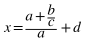
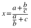
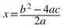

# Creación de mi primer programa

**Programación · 1º DAM · Unidad 2** · Esteban Álvarez

Este tema presenta los elementos básicos de un programa en Java: variables, identificadores, tipos de datos, literales, constantes, operadores, conversión de tipos y comentarios.

## Índice

- [1. Variables](#1-variables)
- [2. Identificadores](#2-identificadores)
- [3. Tipos de datos](#3-tipos-de-datos)
- [4. Declaración de variables](#4-declaración-de-variables)
- [5. Asignación de valores](#5-asignación-de-valores)
- [6. Uso de variables](#6-uso-de-variables)
- [7. Literales](#7-literales)
- [8. Constantes](#8-constantes)
- [9. Operadores](#9-operadores)
- [10. Operadores aritméticos](#10-operadores-aritméticos)
- [11. Precedencia de operadores](#11-precedencia-de-operadores)
- [12. Operadores aritméticos unarios](#12-operadores-aritméticos-unarios)
- [13. Operadores relacionales](#13-operadores-relacionales)
- [14. Operadores lógicos](#14-operadores-lógicos)
- [15. Operadores de asignación](#15-operadores-de-asignación)
- [16. Combinación de operadores](#16-combinación-de-operadores)
- [17. Operadores de Strings](#17-operadores-de-strings)
- [18. La importancia de los literales](#18-la-importancia-de-los-literales)
- [19. Conversión de tipos de datos: casting](#19-conversión-de-tipos-de-datos-casting)
- [20. Comentarios en Java](#20-comentarios-en-java)
- [Resumen del tema](#resumen-del-tema)

## 1. Variables

Una variable se puede ver como una **caja**:

- A esa caja hay que ponerle un **nombre** (con un rotulador, para saber lo que almacena).
  - No es posible tener dos cajas con el mismo nombre, porque no se podrían diferenciar.
  - Pero se puede tener más de una caja si tienen nombres distintos.
- La caja creada solo puede almacenar un **determinado tipo de objetos**.
  - Una caja creada para almacenar libros no puede guardar revistas.
- La caja creada solo puede almacenar **UN objeto**.
  - La caja de libros solo guarda un libro.
  - Se puede cambiar el libro que guarda la caja por otro.

📌 **Aclaración:** _un programa trabaja con datos (para hacer cálculos, mostrarlos, guardarlos en una base de datos…) y la forma de trabajar con ellos es mediante variables. Una variable es una **zona de la memoria RAM** donde se almacena un valor. La memoria RAM es volátil: cuando se apaga el ordenador, su contenido se pierde._

📌 **Aclaración:** _una variable queda definida por su **nombre** (que permite acceder a su valor), su **tipo de dato** (qué información almacena) y el **rango de valores** que admite, que depende del tipo. Por ejemplo, con `int numero = 28;` se tiene una caja en la RAM, llamada `numero`, que contiene un 28._

## 2. Identificadores

Al nombre que se da a una variable se le llama **identificador**. Permite «dirigirse» (señalar, referenciar) a la variable creada.

Un identificador en Java:

- Es una secuencia ilimitada, **sin espacios**, de letras y dígitos.
- **No puede empezar por un número.**
- **Distingue entre mayúsculas y minúsculas.**
- Debe ser **lo más descriptivo posible**.

El identificador es el nombre que se pone a la caja. Por ejemplo: «Libros de clase».

📌 **Aclaración:** _al distinguir mayúsculas y minúsculas, `numero`, `Numero` y `NUMERO` serían tres variables diferentes. Que sea descriptivo no lo exige el lenguaje, pero es imprescindible para entender el código: si una variable almacena una edad, se llama `edad`. Además de letras y dígitos, también se admiten el guion bajo (que se usa en las constantes) y el símbolo `$`._

### Convenciones para variables: lowerCamelCase

Se utiliza la notación **lowerCamelCase**:

- Identificadores **siempre en minúsculas**: `nombre`, `edad`.
- Si hay que utilizar dos o más palabras, se elimina el espacio y **la siguiente inicial va en mayúsculas**: `nombreEmpresa`, `nombreAutorLibro`.


📌 **Aclaración:** _el nombre viene de camello (en inglés, camel): las mayúsculas del interior del identificador recuerdan a sus jorobas. No es una regla del lenguaje sino una convención, pero es la que se sigue en Java (otros lenguajes usan otras)._

Hay que **evitar eñes (ñ), tildes o cualquier otro carácter extraño**. Aunque Java puede soportarlo, hay que tener en cuenta que hay teclados que no tienen determinados símbolos.

📌 **Aclaración:** _además, al compartir, subir o descargar archivos, esos caracteres suelen convertirse en símbolos extraños._

### Convenciones para constantes: `UPPER_SNAKE_CASE`

Las **constantes** son variables que no cambian de valor. Para diferenciarlas de las variables «normales», se utiliza la notación **`UPPER_SNAKE_CASE`**:

- **Siempre en mayúsculas**: `IVA`.
- Si hay que utilizar dos o más palabras, se sustituye el espacio por un **guion bajo**: `IVA_REDUCIDO`.


📌 **Aclaración:** _la notación es visual: una constante escrita en minúsculas seguiría siendo una constante, pero a quien lea el código le costaría distinguirla de una variable. Como todo va en mayúsculas, las palabras no se pueden separar con mayúsculas iniciales y se usa el guion bajo. El nombre viene de serpiente (en inglés, snake): los guiones bajos unen las palabras a ras de suelo, como el cuerpo de una serpiente._

### Identificadores descriptivos

Los identificadores deben ser **descriptivos**, es decir, deben describir qué dato almacena la variable:

- Identificador correcto para una edad: `edad`
- Identificador incorrecto para una edad: `variable`
- Identificador impreciso para una edad de jubilación: `edad`. Más correcto: `edadJubilacion`

Hay que **evitar las abreviaturas excesivas**:

- Identificador incorrecto para una edad: `e`
- Identificador incorrecto para un nombre: `n`

Aunque se recomienda utilizar abreviaturas para palabras largas y omitir la preposición «de»:

- Identificador correcto para el máximo de días trabajados por una persona: `maxDiasTrabajados`
- Identificadores incorrectos: `maximoDeDiasTrabajadosPorUnaPersona`, `enUnLugarDeLaManchaDeCuyoNombreNoQuieroAcordarme`…

### Palabras reservadas

Las **palabras reservadas** (_keywords_) son secuencias de caracteres cuyo uso se reserva al lenguaje y **no pueden usarse para crear identificadores**.

Los IDE utilizan **colores** para diferenciar las palabras reservadas del resto del código.

📌 **Aclaración:** _`public`, `static`, `void` o `int` son palabras reservadas; Eclipse las muestra en granate. Escribir los identificadores en español reduce el riesgo de que coincidan con alguna, porque las palabras reservadas están en inglés._

---

### Ejercicio 1

- Busca una lista de palabras reservadas en Java.
- Abre Eclipse y observa de qué color se muestran las palabras reservadas, los comentarios, los errores y el resto del código.

<details>
<summary>💡 Ver solución</summary>

**Palabras reservadas de Java:**

```text
abstract    continue    for          new          switch
assert      default     goto         package      synchronized
boolean     do          if           private      this
break       double      implements   protected    throw
byte        else        import       public       throws
case        enum        instanceof   return       transient
catch       extends     int          short        try
char        final       interface    static       void
class       finally     long         strictfp     volatile
const       float       native       super        while
```

También está reservado el guion bajo (`_`) usado solo. Además, `true`, `false` y `null` son literales y tampoco pueden usarse como identificadores. `const` y `goto` están reservadas aunque no se utilizan.

**Colores en Eclipse** (tema claro por defecto):

| Elemento | Cómo se muestra |
|---|---|
| Palabras reservadas (`public`, `class`, `int`…) | Granate y en negrita |
| Comentarios (`// …`) | Verde |
| Textos entre comillas (`"Hola mundo!"`) | Azul |
| Variables (`numero`, `edad`…) | Marrón |
| Errores | Subrayado ondulado rojo y una marca roja en el margen |
| Avisos (*warnings*) | Subrayado ondulado amarillo y una marca amarilla en el margen |
| Resto del código (`System`, `String`, nombres de clases…) | Negro |

</details>

🔗 **Más práctica:** [Ejercicio sobre identificadores](https://puntocomnoesunlenguaje.com/ejercicio-sobre-identificadores-java/)

## 3. Tipos de datos

En Java es **obligatorio indicar el tipo de datos** a la hora de declarar la variable.

Un tipo de datos indica **los valores que son válidos** para esa variable (números, letras, etc.) e, indirectamente, **las operaciones que se pueden realizar** con ellos. Por ejemplo, solo se pueden sumar números.

```java
int numero = 5;
// int    → tipo de datos
// numero → nombre o identificador
// 5      → valor
```

Se puede leer el libro de una caja de libros, pero no la manta de una caja de mantas.

📌 **Aclaración:** _por eso se dice que Java es un lenguaje **fuertemente tipado**: cada variable tiene un tipo fijo y solo admite valores de ese tipo (o de uno compatible)._

Hay dos categorías de tipos de datos:

- **Tipos de datos básicos o primitivos.** Son valores simples, como una letra o un número.
- **Tipos de datos de referencia.** Hacen referencia a un lugar de memoria donde se almacena un grupo de valores (objetos y _arrays_).

📌 **Aclaración:** _«un número» es un número completo, no un dígito. Los tipos de referencia más complejos, como los objetos, se estudian más adelante._

### Tipos de datos básicos

Se clasifican en:

- **Números enteros:** `byte`, `short`, `int`, `long`
- **Números reales:** `float`, `double`
- **Carácter:** `char`
- **Booleano o lógico:** `boolean`

#### Números enteros

Los números enteros son los números positivos y negativos **sin coma**. En Java hay cuatro tipos de enteros, dependiendo de lo que ocupan en la memoria RAM:

| Tipo | Tamaño | Rango |
|---|---|---|
| `byte` | 1 byte | de -128 a 127 |
| `short` | 2 bytes | de -32.768 a 32.767 |
| `int` | 4 bytes | de -2.147.483.648 a 2.147.483.647 |
| `long` | 8 bytes | de -9.223.372.036.854.775.808 a 9.223.372.036.854.775.807 |

Habitualmente se usa el tipo **`int`**.

📌 **Aclaración:** _cuanto más ocupa un tipo, más valores distintos puede representar. En 1 byte (8 bits) caben 256 valores: de -128 a 127._

#### Números reales

Los números reales son los números positivos y negativos **con coma**. En Java hay dos tipos de reales, dependiendo de lo que ocupan en la memoria RAM:

| Tipo | Tamaño |
|---|---|
| `float` | 4 bytes |
| `double` | 8 bytes |

Habitualmente se usa el tipo **`double`**.

📌 **Aclaración:** _`double` es más preciso: guarda unas 15 cifras significativas, frente a unas 7 de `float`. Con `float`, los cálculos con muchos decimales pueden dar resultados inexactos._

#### Caracteres

Los caracteres son números, letras y símbolos. Para almacenar **UN** carácter se utiliza el tipo **`char`**, que ocupa 2 bytes.

📌 **Aclaración:** _un `char` guarda un único carácter (la letra `A`, el número `1`, el símbolo `?`…). Con `char` no se pueden almacenar palabras._

#### Booleano

El tipo de datos **`boolean`** almacena dos valores: **`true` o `false`** (verdadero o falso, sí o no). Su información cabe en 1 bit, porque solo hay dos valores posibles. Más adelante se verá su utilidad, en las estructuras condicionales y en los bucles.

### Tipos de datos referenciados

A partir de los ocho tipos de datos básicos se pueden construir los tipos de datos referenciados. Es el caso de los **arrays**: un conjunto de elementos referenciados por el mismo identificador.

En este grupo también está el tipo **`String`** (con la **S** mayúscula), que permite almacenar **cadenas de caracteres** (palabras o frases).

📌 **Aclaración:** _los tipos básicos se escriben en minúscula (`int`, `double`, `char`…), mientras que `String` empieza por mayúscula. `String` resuelve la limitación de `char`, que solo guarda un carácter._

## 4. Declaración de variables

La **declaración de variables** es la creación de las variables.

**Sintaxis:** se indica primero el tipo de dato que va a almacenar y, a continuación, el nombre. Finaliza con **punto y coma** (`;`).

```java
tipoDeDato nombreVariable;
int numero;
boolean trabaja;
```

Las variables se pueden declarar en cualquier bloque de código (dentro de llaves).

📌 **Aclaración:** _técnicamente, la declaración indica que se va a usar una variable de un tipo concreto; para empezar, basta con entenderla como su creación. Aunque se pueden escribir varias instrucciones en una misma línea, conviene escribir cada una en su propia línea para distinguirlas con claridad._

📌 **Aclaración:** _Eclipse marca los problemas con colores, como una luz roja en el coche: el **subrayado rojo** es un error de compilación y el programa no funcionará hasta corregirlo (mientras se escribe una instrucción es normal que aparezca; si sigue al terminarla, hay que revisarla). El **subrayado amarillo** es un aviso (warning). Por ejemplo, `The value of the local variable numero is not used` indica que se ha declarado una variable que todavía no se usa._

---

### Ejercicio 2

Declara en Eclipse las siguientes variables:

- Una variable de tipo entero y nombre «edad».
- Una variable de tipo booleano y nombre «llueve».
- Una variable de tipo real y nombre «salario».
- Una variable de tipo carácter y nombre «puerta piso».
- Una variable de tipo cadena de caracteres y nombre «raza de animal».

<details>
<summary>💡 Ver solución</summary>

```java
int edad;
boolean llueve;
double salario;
char puertaPiso;
String razaAnimal;
```

- Cada línea se lee de izquierda a derecha: «variable de tipo entero y nombre `edad`».
- Para los reales se usa habitualmente `double`.
- `puertaPiso` es un `char` porque guarda una sola letra (la puerta A, B, C…).
- En `razaAnimal` se omite la preposición «de» y se aplica lowerCamelCase.
- Los tipos básicos van en minúscula (`double`, no `Double`), mientras que `String` va con mayúscula.

</details>

La declaración se puede ver como una **reserva** del tipo «en mi programa voy a usar la variable X del tipo de datos Y»:

```java
int edad; // Voy a usar la variable de tipo entero y nombre «edad»
```

A partir de este momento, en `edad` solo se puede almacenar **UN número entero**.

El equivalente en el ejemplo de las cajas sería: «Voy a reservar esta caja para almacenar libros y le voy a poner el nombre librosDeClase».

📌 **Aclaración:** _como cada variable guarda un único valor, su nombre suele ir en singular: `edad` y no `edades`, `salario` y no `salarios`._

Si se declara una variable con un identificador, **no se puede declarar otra variable con el mismo nombre** (aunque sea de diferente tipo). En una llamada de teléfono:

— Hola, ¿está Antonio?
— ¿Qué Antonio, padre o hijo?

```java
int edad;
float edad; // Error: ya existe una variable llamada edad
```

> ⚠️ **Atención:** Java no permite dos variables con el mismo nombre en el mismo bloque, y Eclipse muestra el error `Duplicate local variable edad`. Hay que cambiar el nombre de una de ellas (por ejemplo, `edadPadre` y `edadHijo`).

También es posible declarar **N variables en la misma línea**, siempre que sean del mismo tipo de datos:

```java
int edad, numeroMascotas;
String nombre, apellido1, apellido2, dni;
```

📌 **Aclaración:** _resulta útil para agrupar variables relacionadas, como los datos de una persona._

🔗 **Más práctica:** [Ejercicios resueltos de declaración de variables](https://puntocomnoesunlenguaje.com/ejercicios-resueltos-declaraciones-de-variables-java/)

## 5. Asignación de valores

### Operador de asignación (`=`)

Las variables declaradas anteriormente no tienen ningún valor: **no están inicializadas**.

El operador `=` permite **asignar** (dar) valores a una variable ya declarada. Se puede utilizar:

- Una vez declarada la variable:

  ```java
  int numero;  // Se declara la variable entera de nombre numero
  numero = 5;  // A numero se le asigna el valor 5
  ```

- En la propia declaración de la variable:

  ```java
  int numero = 5;  // Se hacen dos acciones en una misma línea:
                   // se declara la variable numero y se le asigna el valor 5
  ```

📌 **Aclaración:** _inicializar es asignar un valor inicial. Solo se puede dar valor a una variable ya declarada: primero se declara y después se asigna. Si la asignación va justo en la línea siguiente a la declaración, conviene juntar ambas en una sola línea; si entre ellas hay otras instrucciones, se escriben por separado._

> ⚠️ **Atención:** una variable no se puede usar antes de darle un valor. Por ejemplo, mostrar con `println` una variable declarada pero no inicializada produce el error `The local variable numero may not have been initialized`.

📌 **Aclaración:** _conviene acostumbrarse a leer cada línea completa: `int edad = 45;` «declara una variable de tipo entero y nombre edad, y le asigna el valor 45»._

En resumen: **a la parte izquierda del `=` se le asigna el valor que hay en la parte derecha**.

```java
numero = 5;  // El 5 de la derecha se guarda en numero, a la izquierda
```

> ⚠️ **Atención:** el operador `=` es el operador de **asignación**, no el operador «igual». `numero = 5;` no significa que `numero` sea igual a 5: significa que a `numero` se le asigna el valor 5.

El operador de asignación es equivalente a **meter algo en la caja**.

📌 **Aclaración:** _la asignación se puede imaginar como un muro: a la izquierda está la variable que recibe el valor y a la derecha, lo que se le asigna. Primero se resuelve todo lo que hay a la derecha y después el resultado se guarda en la variable de la izquierda._

## 6. Uso de variables

Una vez que se declara una variable y se le asigna un valor, el siguiente paso es **utilizarla**. Utilizar una variable implica **acceder a su valor** para:

- **Mostrárselo al usuario por pantalla:**

  ```java
  int numero = 5;
  System.out.println(numero);  // Muestra al usuario el 5
                               // Se «sustituye» numero por su valor
  ```

- **Utilizarlo en otras asignaciones:**

  ```java
  int numero1 = 5;
  int numero2 = 8;
  numero1 = numero2;  // Ahora numero1 vale lo que numero2 (8)
                      // numero2 sigue valiendo lo mismo (8)
  ```

- **Utilizarlo en operaciones:**

  ```java
  int numero1 = 5;
  int numero2 = 8;
  numero1 = numero2 + 3;  // Ahora numero1 vale 11: numero2 (8) + 3 = 11
  ```

**Cada vez que se usa una variable, hay que sustituir su nombre por su valor.** Es importante tener clara la diferencia entre **asignación** y **uso**.

Al mostrar una variable, se escribe su nombre **sin comillas**; entre comillas se mostraría el texto tal cual:

```java
int edad = 45;
System.out.println(edad);    // Muestra 45
System.out.println("edad");  // Muestra la palabra edad
```

📌 **Aclaración:** _con una variable se dan tres pasos: declaración, asignación y uso._

📌 **Aclaración:** _en una asignación, la variable de la **izquierda** es la única que cambia de valor; las variables de la **derecha** solo se usan: se sustituyen por su valor y no se modifican. En `numero1 = numero2 + 3;`, donde aparece `numero2` se lee un 8: 8 + 3 = 11, y ese 11 se guarda en `numero1`._

> ⚠️ **Atención:** `System.out.println` se escribe exactamente así, respetando mayúsculas y minúsculas. `system.out.println` produce el error `system cannot be resolved` y `System.out.Println` produce `The method Println(int) is undefined for the type PrintStream`.

> ⚠️ **Atención:** una variable se declara **una sola vez**. Para cambiar su valor después, se escribe su nombre sin el tipo (`numero1 = numero2;`). Escribir `int numero1 = numero2;` cuando `numero1` ya existe produce el error `Duplicate local variable numero1`.

**Importante:** atención a este uso:

```java
int numero1 = 5;
int numero2 = 8;
numero1 = numero1 + numero2;
// A numero1 se le asigna el valor de numero1 (5) + el de numero2 (8)
// numero1 ahora almacena el valor 13 (5 + 8)
```

📌 **Aclaración:** _una misma variable puede aparecer a ambos lados del `=`. Primero se calcula la parte derecha con el valor que tenía la variable (5 + 8 = 13) y después se guarda el resultado en la izquierda: `numero1` pasa a valer 13 y `numero2` sigue valiendo 8._

```java
System.out.println(numero1);  // Muestra 13
System.out.println(numero2);  // Muestra 8
```

### Variables auxiliares

**Importante:** si una variable ya tenía un valor y se le asigna uno nuevo, **el valor antiguo se pierde**:

```java
int numero = 5;  // numero almacena el valor 5
numero = 8;      // Ahora almacena el valor 8. No hay forma posible
                 // de acceder o recuperar el valor anterior (5)
```

En la caja de libros hay un ejemplar de «El Quijote» y se quiere guardar en ella el libro de «Los miserables». Para poder hacerlo, primero hay que destruir el libro de «El Quijote»; después ya se puede guardar el de «Los miserables».

Si se quiere guardar el valor anterior de una variable, se necesita una **variable auxiliar**:

```java
int numero = 5;           // numero almacena el valor 5
int auxiliar = numero;    // auxiliar almacena el valor de numero
numero = 8;               // numero almacena el valor 8
                          // El valor anterior (5) se almacena en auxiliar
```

Para no destruir El Quijote, hay que hacerse con otra caja y guardarlo en ella.

📌 **Aclaración:** _la variable auxiliar es como una foto del valor que tenía la variable antes de cambiarlo._

El uso de una variable auxiliar es la solución habitual, y la más clara, para el siguiente problema.

---

### Ejercicio 3

Intercambia los valores de las variables (`numero1` debe almacenar 8 y `numero2`, 5):

```java
int numero1 = 5;
int numero2 = 8;
```

<details>
<summary>💡 Ver solución</summary>

Lo primero que se suele intentar no funciona:

```java
numero1 = numero2;  // numero1 vale 8
numero2 = numero1;  // numero2 también vale 8: el 5 se ha perdido
```

La solución es guardar antes el valor de `numero1` en una variable auxiliar:

```java
int numero1 = 5;
int numero2 = 8;

int auxiliar = numero1;  // Se guarda el valor de numero1 antes de modificarlo
numero1 = numero2;       // numero1 vale 8, correcto. Pero numero2 también, incorrecto
numero2 = auxiliar;      // Ahora numero2 vale 5. Está todo correcto

System.out.println(numero1);
System.out.println(numero2);
```

```text
8
5
```

Si se quiere intercambiar El Quijote y Los miserables, se necesita una tercera caja donde dejar uno de los libros mientras se hace el cambio.

También funciona guardando primero `numero2` (`auxiliar = numero2; numero2 = numero1; numero1 = auxiliar;`). Usar dos variables auxiliares es posible, pero peor: una de ellas sobra.

</details>

## 7. Literales

Los **literales** son los valores que puede tomar una variable. Su conocimiento es fundamental en la asignación de valores a una variable.

Los literales son diferentes según el tipo de datos: **entero**, **real**, **carácter**, **booleano** o **String**.

📌 **Aclaración:** _en `numero1 = 5;`, el 5 es un literal. Sin literales no se puede dar valor a una variable._

### Literales de tipo entero

Los literales para los tipos de datos enteros (`byte`, `short`, `int`, `long`) son números:

- **enteros** (sin coma);
- **positivos, negativos o cero** (0):
  - para indicar un número negativo es obligatorio usar el símbolo `-`;
  - el uso del símbolo `+` para los positivos es opcional y no se suele usar.

El número 0 no es ni positivo ni negativo: es 0.

La **base decimal** es la más habitual para representar literales enteros. Es la que se usa en la vida diaria:

```java
int numero1 = 985;  // Se asigna el literal positivo 985
int numero2 = -25;  // Se asigna el literal negativo -25
int numero3 = 0;    // Se asigna el literal 0
int numero4 = +3;   // Se asigna el literal positivo 3. Símbolo + opcional
```

Pero también se pueden asignar valores en **otras bases de numeración**:

- **Binario:** formado por uno o más dígitos del 0 al 1. Empiezan siempre por `0b` o `0B`.

  ```java
  int numeroBinario = 0b0110;  // Se asigna el literal binario 0110
  ```

- **Octal:** formado por uno o más dígitos del 0 al 7. Empiezan siempre por `0`.

  ```java
  int numeroOctal = 071207;  // Se asigna el literal octal 71207
  ```

- **Hexadecimal:** formado por uno o más dígitos del 0 al 9 y letras de la A a la F (mayúsculas o minúsculas). Empiezan siempre por `0x` o `0X`.

  ```java
  int numeroHexa = 0xF019;  // Se asigna el literal hexadecimal F019
  ```

📌 **Aclaración:** _en decimal, estos tres ejemplos valen 6, 29319 y 61465. Por eso, en Java un cero a la izquierda no es inofensivo: `010` es un número octal y vale 8._

### Literales de tipo real

Los literales para los tipos de datos reales (`float` y `double`) son números:

- en **base decimal** (números «normales»);
- con una **parte entera**:
  - si la parte entera es 0, puede omitirse;
  - se aplica la misma norma para positivos y negativos que en los enteros;
- un **punto decimal**;
- y una **parte fraccionaria** (decimales).

```java
double numero1 = -3.985;
double numero2 = .46;
double numero3 = +0.985;
```

> ⚠️ **Atención:** en el código, la parte decimal se separa con un **punto** (`3.45`). Escribir `3,45` produce un error.

📌 **Aclaración:** _como en una calculadora, `.46` equivale a `0.46`. Un número entero también es un número real, así que `double numero = 8;` es correcto; al mostrarlo por pantalla aparece `8.0`._

**Importante:** los literales de tipo real **por defecto siempre son `double`**. Si se quiere que sean `float`, hay que añadir el sufijo `f` o `F`:

```java
float numero1 = -3.985f;
float numero2 = .46F;
```

> ⚠️ **Atención:** sin el sufijo, `float numero1 = -3.985;` produce el error `Type mismatch: cannot convert from double to float`, porque el literal `-3.985` es un `double`.

📌 **Aclaración:** _un `double` ocupa 8 bytes y un `float`, 4: es como querer meter un objeto grande en una caja pequeña. Este es otro motivo para usar habitualmente `double`._

🔗 **Más práctica:** [Ejercicio sobre literales numéricos](https://puntocomnoesunlenguaje.com/ejercicio-sobre-literales-java/)

### Literales de tipo carácter

Los literales de tipo `char` contienen **un solo carácter encerrado entre comillas simples**:

```java
char caracter1 = 'M';  // Se asigna el literal M
char caracter2 = 'j';  // Se asigna el literal j
char caracter3 = '9';  // Se asigna el literal 9
```

Las **secuencias de escape** también son literales de tipo carácter:

```java
char saltoDeLinea = '\n';
char tabulador = '\t';
```

> ⚠️ **Atención:** sin las comillas simples, Java interpreta la letra como el nombre de una variable: `char caracter = M;` produce el error `M cannot be resolved to a variable`.

📌 **Aclaración:** _aunque `\n` se escriba con dos símbolos, es un único carácter: el salto de línea. Dentro de un texto también funcionan: cada `\n` hace un salto de línea y cada `\t`, una tabulación._

---

### Ejercicio 4

- Prueba el código `System.out.println("Buenos\ndías");`
- Busca más información sobre las secuencias de escape y la tabla ASCII.

<details>
<summary>💡 Ver solución</summary>

El `\n` produce un salto de línea en mitad del texto:

```text
Buenos
días
```

**Secuencias de escape más habituales:**

| Secuencia | Significado |
|---|---|
| `\n` | Salto de línea |
| `\t` | Tabulador |
| `\\` | Barra invertida (`\`) |
| `\"` | Comilla doble dentro de un `String` |
| `\'` | Comilla simple dentro de un `char` |

Para escribir literalmente `\t` en lugar de un tabulador, se duplica la barra:

```java
System.out.println("Buenos\tdías");   // Buenos   días  (con un tabulador)
System.out.println("Buenos\\tdías");  // Buenos\tdías
```

**Tabla ASCII:** asocia a cada carácter un número. Por ejemplo, `'A'` es el 65, `'a'` el 97, `'0'` el 48 y el espacio, el 32. Java usa Unicode, cuyos primeros 128 códigos coinciden con la tabla ASCII. Esta relación se aprovecha en la conversión de tipos (apartado 19).

</details>

🔗 **Más práctica:** [Ejercicios sobre literales de tipo char](https://puntocomnoesunlenguaje.com/ejercicios-sobre-literales-java-de-tipo-char/)

### Literales de tipo boolean

El tipo `boolean` es binario, por lo que solo tiene dos literales: **`true`** y **`false`**.

```java
boolean llueve = false;     // NO llueve
boolean encendido = true;   // SÍ está encendido
```

📌 **Aclaración:** _un `boolean` funciona como un interruptor: o está encendido o está apagado. `true` y `false` se escriben sin comillas._

### Literales de tipo String

Están formados por:

- **0 o más caracteres**,
- encerrados entre **comillas dobles**,
- y pueden incluir **secuencias de escape**.

```java
String cadena1 = "Esto es una cadena de caracteres";
String cadena2 = "Salto\nde línea";
String cadena3 = " ";  // Cadena con un espacio en blanco
```

> ⚠️ **Atención:** los `String` van entre comillas **dobles** (`"Hola"`) y los `char`, entre comillas **simples** (`'H'`). Confundirlas es un error frecuente.

Cuando se quiere inicializar un `String` sin valor, hay dos opciones:

- Asignarle la **cadena vacía**:

  ```java
  String cadena4 = "";  // "" es la cadena vacía
  ```

- Asignarle el valor **`null`** (nada):

  ```java
  String cadena5 = null;  // cadena5 no almacena nada
  ```

La diferencia es muy sutil, pero clara:

- `cadena4` tiene el valor `""`.
- `cadena5` **no tiene ningún valor** (más tarde se le podrá asignar uno).

Se utiliza `null` para inicializar un `String` si la cadena vacía no es un valor inicial válido para esa variable:

```java
String nombrePersona1 = "";
String nombrePersona2 = null;
```

- Pregunta: Persona1, ¿cuál es tu nombre? Respuesta: `""` (una cadena vacía).
- Pregunta: Persona2, ¿cuál es tu nombre? Respuesta: todavía no tengo nombre.

📌 **Aclaración:** _el valor `null` se estudia con más detalle en el tema de clases y objetos._

🔗 **Más práctica:** [Ejercicio sobre literales de tipo String](https://puntocomnoesunlenguaje.com/ejercicio-sobre-literales-de-tipo-string/)

---

### Ejercicio 5

Crea una tabla que resuma todos los tipos de datos (enteros, reales, carácter, booleano y cadena de caracteres) y sus literales. Utiliza esta plantilla:

| Tipo | Nombre | Forma de inicializar |
|---|---|---|
| Enteros | `byte` | `byte num = 5;` |
| | `short` | `short num = -2;` |
| | … | … |
| Reales | … | … |

<details>
<summary>💡 Ver solución</summary>

| Tipo | Nombre | Forma de inicializar |
|---|---|---|
| Enteros | `byte` | `byte num = 5;` |
| | `short` | `short num = -2;` |
| | `int` | `int num = 985;` |
| | `long` | `long num = 48000000;` |
| Reales | `float` | `float num = -3.985f;` (con `f` o `F`) |
| | `double` | `double num = .46;` |
| Carácter | `char` | `char letra = 'M';` (comillas simples) |
| Booleano | `boolean` | `boolean llueve = false;` (solo `true` o `false`) |
| Cadena de caracteres | `String` | `String nombre = "Juan";` (comillas dobles), `""` o `null` |

Los enteros también admiten literales en binario (`0b`), octal (`0`) y hexadecimal (`0x`). Si un número no cabe en un `int`, se añade la letra `L` al final (por ejemplo, `long poblacion = 8000000000L;`), igual que la `f` de los `float`.

</details>

## 8. Constantes

Las constantes siguen la notación `UPPER_SNAKE_CASE`, como se vio en el apartado de identificadores. Las **constantes** son variables cuyo valor **no se puede cambiar**.

Se declaran, asignan y usan igual que las variables, salvo que hay que añadir la palabra reservada **`final`** en la declaración:

```java
final double DESCUENTO = 2.5;
final int MAX_ALUMNOS = 25;
```

> ⚠️ **Atención:** a una constante solo se le puede dar valor una vez. Una segunda asignación (por ejemplo, `IVA = 9;` cuando `IVA` es `final`) produce el error `The final local variable IVA cannot be assigned. It must be blank and not using a compound assignment`.

📌 **Aclaración:** _una constante también se puede declarar en una línea y recibir su valor más adelante, pero solo una vez. Lo que la convierte en constante es `final`, no las mayúsculas: para tener una constante bien definida, se escribe el nombre en mayúsculas, se declara con `final` y se inicializa una sola vez._

---

### Ejercicio 6

Declara una variable por cada tipo de datos que se ha visto (`byte`, `short`, `float`…):

- Elige unos identificadores descriptivos para la información que almacenan.
- Dos de estas variables son constantes.
- Tres de las variables se declaran primero y se inicializan en otra línea.
- El resto se declaran e inicializan en la misma línea.
- Muestra por pantalla el valor de todas las variables.
- A continuación, añade tres líneas nuevas para modificar el valor de tres variables (no toques el código hecho en los apartados anteriores).
- Vuelve a mostrar por pantalla el valor de estas tres variables.

<details>
<summary>💡 Ver solución</summary>

```java
public class TiposDeDatos {

    public static void main(String[] args) {

        // Dos constantes
        final short MAX_ALUMNOS = 30;
        final double IVA = 21.0;

        // Tres variables que se declaran primero...
        int edad;
        char inicialNombre;
        boolean aprobado;

        // ...y se inicializan en otra línea
        edad = 19;
        inicialNombre = 'E';
        aprobado = true;

        // El resto se declaran e inicializan en la misma línea
        byte numeroHermanos = 2;
        long habitantesEspana = 48000000;
        float altura = 1.75f;
        String ciudad = "Oviedo";

        // Se muestra el valor de todas las variables
        System.out.println(MAX_ALUMNOS);
        System.out.println(IVA);
        System.out.println(edad);
        System.out.println(inicialNombre);
        System.out.println(aprobado);
        System.out.println(numeroHermanos);
        System.out.println(habitantesEspana);
        System.out.println(altura);
        System.out.println(ciudad);

        // Se modifican tres variables (las constantes no se pueden modificar)
        edad = 20;
        altura = 1.80f;
        ciudad = "Gijón";

        // Se vuelven a mostrar esas tres variables
        System.out.println(edad);
        System.out.println(altura);
        System.out.println(ciudad);
    }
}
```

```text
30
21.0
19
E
true
2
48000000
1.75
Oviedo
20
1.8
Gijón
```

`1.80f` se muestra como `1.8`, porque los ceros finales de la parte decimal no se escriben.

</details>

🧪 **Test del Campus Virtual:** Variables y asignación.

## 9. Operadores

Los **operadores** llevan a cabo operaciones sobre unos **operandos**, representados por literales (números, letras…) y/o identificadores (variables).

Los operadores pueden ser **unarios**, **binarios** o **ternarios**, según el número de operandos que utilicen sean uno, dos o tres, respectivamente.

Actúan sobre los tipos de datos primitivos y devuelven también un tipo de dato primitivo (salvo la concatenación de `String`, que devuelve un `String`):

- Una suma de dos números enteros devuelve un número entero.
- Una división de dos números enteros devuelve también un número **entero**: `5 / 2` da `2` (se descartan los decimales).

Los operadores se combinan con los literales y/o identificadores para formar **expresiones**:

```java
numero1 + 3  // Esto es una expresión formada por un identificador
             // (numero1), el operador + y el literal 3
```

Una expresión **se evalúa y produce un único resultado** de un tipo de datos determinado:

```java
numero1 + 3  // Esta expresión produce un resultado que dependerá
             // del valor de numero1
```

📌 **Aclaración:** _si `numero1` vale 5, la expresión da 8; si vale -3, da 0._

El resultado de una expresión se puede usar para:

- **Asignárselo a una variable:**

  ```java
  int suma = numero1 + 3;  // El resultado de sumar numero1 + 3 se asigna
                           // a la variable entera suma
  ```

- **Mostrarlo por pantalla:**

  ```java
  System.out.println(numero1 * 2);  // Se muestra el resultado de multiplicar
                                    // numero1 por 2
  ```

`suma = numero1 + 3;` ya sería la acción completa, por lo que se tiene una **sentencia** o **instrucción**. Las instrucciones acaban siempre con **punto y coma** (`;`) final.

> ⚠️ **Atención:** una expresión sola no es una instrucción. `diasSemana + 2;` produce el error `Syntax error on token "+", invalid AssignmentOperator`: falta asignar el resultado a una variable, por ejemplo `diasSemana = diasSemana + 2;`.

Los operadores se pueden clasificar en las siguientes categorías:

- Aritméticos
- Relacionales
- Condicionales
- Lógicos
- De asignación

📌 **Aclaración:** _los operadores condicionales no se tratan en este tema._

## 10. Operadores aritméticos

Los operadores aritméticos permiten hacer **operaciones matemáticas**.

Uso:

```java
variable = (valor1|variable1) operador (valor2|variable2);
// La barra vertical | indica una alternativa (valor1 o variable1)
```

| Operador | Descripción | Ejemplo |
|---|---|---|
| `+` | Suma / concatenación | `a + b` |
| `-` | Resta | `a - b` |
| `/` | División | `a / b` |
| `*` | Multiplicación | `a * b` |
| `%` | Resto de la división | `a % b` |

Ejemplos de uso con literales:

```java
suma = 3 + 7;            // Resultado: 10
resta = 5 - 2;           // Resultado: 3
multiplicacion = 3 * 2;  // Resultado: 6
division = 4 / 2;        // Resultado: 2
division2 = 5 / 2;       // Resultado: 2
resto = 5 % 3;           // Resultado: 2
```

📌 **Aclaración:** _`5 % 3` da 2 porque el 3 cabe una vez en el 5 (3 × 1 = 3) y sobran 2._

Ejemplos de uso con variables:

```java
suma = num1 + 3;   // Se suma 3 al valor de la variable num1
resta = num1 - 4;  // Se resta 4 al valor de la variable num1
```

También se pueden combinar dos variables, por ejemplo `suma = num1 + num2;`.

---

### Ejercicio 7

Declara dos variables numéricas y asígnales un valor:

- Calcula su suma y almacena el resultado en otra variable.
- Haz lo mismo para la multiplicación.
- Muestra la suma y la multiplicación por pantalla.
- Muestra por pantalla el resultado de la división y el resto, pero hazlo directamente, sin guardar el resultado de las operaciones en variables.

<details>
<summary>💡 Ver solución</summary>

```java
public class Operaciones {

    public static void main(String[] args) {

        int num1 = 4;
        int num2 = 7;

        int suma = num1 + num2;
        int multiplicacion = num1 * num2;

        System.out.println(suma);
        System.out.println(multiplicacion);

        System.out.println(num1 / num2);
        System.out.println(num1 % num2);
    }
}
```

```text
11
28
0
4
```

- La suma y la multiplicación se guardan en variables: si más adelante se vuelven a necesitar, basta con usar `suma` o `multiplicacion`.
- La división y el resto se muestran directamente: no se guardan en ningún sitio y, si se volvieran a necesitar, habría que calcularlos otra vez.
- `4 / 7` da 0 porque es una división entre enteros, y `4 % 7` da 4, porque el 7 no cabe ninguna vez en el 4.

</details>

---

### Ejercicio 8

Haz un programa que calcule la longitud de una circunferencia según la fórmula `2 * PI * r`:

- `PI` debe ser una constante con una precisión de 4 decimales.
- `r` es una variable que almacena el radio. Dale un valor cualquiera de tipo real.
- Crea otra variable para el resultado.
- Muestra el resultado por pantalla.

<details>
<summary>💡 Ver solución</summary>

```java
public class Circunferencia {

    public static void main(String[] args) {

        final double PI = 3.1416;
        double radio = 4.0;
        double longitud = 2 * PI * radio;

        System.out.println(longitud);
    }
}
```

```text
25.1328
```

- La variable del resultado tiene que ser `double`: al multiplicar por un número con decimales, el resultado también los tiene. Conviene pensar siempre qué tipo de dato devuelve una operación antes de declarar la variable que lo guarda.
- Java ya tiene guardado el valor de π (`Math.PI`), pero el objetivo aquí es practicar con constantes.

</details>

---

### Ejercicio 9

Haz un programa que calcule el descuento de un producto:

- Utiliza una constante de tipo entero para el porcentaje de rebaja, con el valor que quieras de 0 a 100.
- Crea una variable con el precio del producto. Asígnale el valor que quieras.
- Crea otra variable donde se almacene el descuento que se aplica al artículo según la fórmula `descuento = precio * porcentaje de rebaja / 100`.
- Muestra el resultado por pantalla.

<details>
<summary>💡 Ver solución</summary>

```java
public class Descuento {

    public static void main(String[] args) {

        final int PORCENTAJE_REBAJA = 20;
        double precio = 80.0;
        double descuento = precio * PORCENTAJE_REBAJA / 100;

        System.out.println(descuento);
    }
}
```

```text
16.0
```

El precio se declara como `double` para que la operación no pierda decimales. Si el precio y el porcentaje fueran ambos `int`, por ejemplo 75 y 15, la operación daría 11 en lugar de 11.25, porque se haría una división entera.

</details>

🔗 **Más práctica:** [Ejercicio sobre operadores aritméticos](https://puntocomnoesunlenguaje.com/ejercicio-sobre-operadores-aritmeticos-java/)

### Potencia y raíz cuadrada

Hay operaciones matemáticas para las que no existe un operador aritmético:

- **Potencia:** para elevar un número `n` a una potencia `a` se usa `Math.pow(n, a)`.

  ```java
  double n1 = Math.pow(23, 2);  // 23 al cuadrado → 529.0
  double n2 = Math.pow(2, 3);   // 2 al cubo → 8.0
  ```

- **Raíz cuadrada:** para la raíz cuadrada de `n` se usa `Math.sqrt(n)`.

  ```java
  double n3 = Math.sqrt(4);    // Raíz cuadrada de 4 → 2.0
  double n4 = Math.sqrt(328);  // Raíz cuadrada de 328 → 18.110770276274835
  ```

📌 **Aclaración:** _`23 * 23` también calcula el cuadrado, pero `Math.pow` resulta más claro, sobre todo con exponentes grandes. En `Math.pow` primero va el número y después la potencia. El nombre `sqrt` viene de square root, raíz cuadrada en inglés._

> ⚠️ **Atención:** `Math.pow` y `Math.sqrt` devuelven siempre un `double`. Su resultado no se puede guardar directamente en un `int`: `int n = Math.pow(2, 3);` produce el error `Type mismatch: cannot convert from double to int`.

## 11. Precedencia de operadores

¿Qué resultado devuelve el cálculo `2 + 3 × 4`? ¿20?

El resultado no es 20, porque **la multiplicación tiene precedencia sobre la suma** y se aplica `2 + (3 × 4)`.

La tabla de precedencias de operadores es compleja; por eso es importante tener en cuenta las siguientes precedencias:

- La **multiplicación y la división** tienen precedencia sobre la **suma y la resta**.
- El operador **Y** (`&&`) tiene precedencia sobre el **O** (`||`).

**Recomendación: en caso de duda, usar paréntesis.**

- `2 + 3 × 4 = 14`
- Pero si no se está seguro, se añaden paréntesis: `2 + (3 × 4) = 14`
- Además, con paréntesis se puede modificar la precedencia: `(2 + 3) × 4 = 20`

Esto no es nuevo: en matemáticas ya aparece este mismo problema.

```java
System.out.println(2 + 3 * 4);    // 14
System.out.println(2 + (3 * 4));  // 14
System.out.println((2 + 3) * 4);  // 20
```

📌 **Aclaración:** _conviene usar paréntesis tanto en las operaciones matemáticas como en las relacionales: simplifican la lectura y ayudan a entender el código, a quien lo escribe y a cualquiera que lo lea. La multiplicación y la división tienen la misma precedencia entre sí (igual que la suma y la resta); cuando coinciden, se evalúan de izquierda a derecha: `8 / 2 * 4` da 16._

📌 **Aclaración:** _para pasar una expresión algebraica a Java, lo primero es colocar los paréntesis. En una mezcla de sumas, restas y divisiones, los paréntesis dejan claro qué se calcula antes sin depender de las reglas de precedencia._

---

### Ejercicio 10

Escribe en Java las siguientes expresiones algebraicas:

a) 

b) 

c) 

<details>
<summary>💡 Ver solución</summary>

```java
double xa = (a + b / c) / a + d;
double xb = (a + b / c) / (a / b + c);
double xc = (b * b - 4 * a * c) / (2 * a);
// También: (Math.pow(b, 2) - 4 * a * c) / (2 * a)
```

- Cada fracción se convierte en una división con **paréntesis alrededor del numerador y del denominador** cuando tienen más de un término. Por ejemplo, el denominador `2a` se escribe `(2 * a)`: sin los paréntesis, `/ 2 * a` dividiría entre 2 y luego multiplicaría por `a`.
- Las variables deben ser `double`. Con `a = 2`, `b = 3`, `c = 4` y `d = 5`, los resultados son 6.375, 0.5892857142857143 y -5.75. Si fueran `int`, `b / c` sería una división entera y la expresión a) daría 6 en lugar de 6.375.
- Sin paréntesis, `a + b / c / a + d` daría 7.375, que no corresponde a la fórmula.

</details>

🔗 **Más práctica:** [Convertir expresiones algebraicas en algorítmicas](https://puntocomnoesunlenguaje.com/convertir-expresiones-algebraicas-en-algoritmicas/)

🔗 **Más práctica:** [Convertir expresiones algorítmicas en algebraicas](https://puntocomnoesunlenguaje.com/convertir-expresiones-algoritmicas-en-expresiones-algebraicas/)

## 12. Operadores aritméticos unarios

Son operadores que **solo requieren un operando** para funcionar:

| Operador | Descripción |
|---|---|
| `+` | Operador unario suma. Indica un número positivo |
| `-` | Operador unario resta. Invierte el signo de un número |
| `++` | Operador de incremento. Incrementa el valor en 1 |
| `--` | Operador de decremento. Decrementa el valor en 1 |
| `!` | Operador de complemento lógico. Invierte el valor de un booleano |

### Operadores unarios de suma y resta

El uso del operador unario suma es **redundante**. El operador unario resta **invierte el signo** de un número:

```java
int num1 = 2;
int num2 = -7;
System.out.println(-num1);  // Imprimirá por pantalla un -2
num1 = -num2;               // num1 almacena 7 (positivo)
```

### Operadores de incremento y decremento

La variable a la que se aplican estos operadores incrementa o decrementa su valor **en 1**:

```java
++variable;  // Equivale a: variable = variable + 1
variable++;  // Equivale a: variable = variable + 1
--variable;  // Equivale a: variable = variable - 1
variable--;  // Equivale a: variable = variable - 1
```

📌 **Aclaración:** _`numero++;` es una instrucción completa aunque no aparezca ningún `=`: incrementa la variable y guarda el resultado en ella misma._

Hay que tener **cuidado con su uso como prefijo o como sufijo** en una asignación.

**Uso como prefijo:**

```java
suma = ++variable;
// Es lo mismo que:
variable = variable + 1;
suma = variable;
```

**Uso como sufijo:**

```java
suma = variable++;
// Es lo mismo que:
suma = variable;
variable = variable + 1;
```

📌 **Aclaración:** _con el prefijo (`++variable`), primero se incrementa la variable y después se usa su nuevo valor; con el sufijo (`variable++`), primero se usa el valor que tenía y después se incrementa. Como instrucción suelta (`variable++;`) da igual uno que otro._

> ⚠️ **Atención:** lo habitual es escribir `variable++`, pero dentro de una expresión el resultado puede no ser el esperado: el incremento se produce después de usar el valor.

---

### Ejercicio 11

- Crea una variable entera `numero1` con el valor 5.
- Crea una variable entera `numero2` con el valor que contiene `numero1`. No se permite hacer `numero2 = 5`.
- `numero1` y `numero2` valen lo mismo. Ejecuta estas líneas de código:

  ```java
  System.out.println(numero1++);
  System.out.println(++numero2);
  ```

- Analiza por qué el resultado es diferente.
- ¿Qué valor tienen las dos variables? Compruébalo con:

  ```java
  System.out.println(numero1);
  System.out.println(numero2);
  ```

<details>
<summary>💡 Ver solución</summary>

```java
int numero1 = 5;
int numero2 = numero1;

System.out.println(numero1++);
System.out.println(++numero2);

System.out.println(numero1);
System.out.println(numero2);
```

```text
5
6
6
6
```

- `numero1++` usa el sufijo: primero se muestra el valor que tenía `numero1` (5) y después se incrementa.
- `++numero2` usa el prefijo: primero se incrementa `numero2` y después se muestra su nuevo valor (6).
- Al final, las dos variables valen 6: las dos se han incrementado en 1. La diferencia está en el momento en que se muestran.

</details>

🔗 **Más práctica:** [Ejercicio sobre operadores de incremento y decremento](https://puntocomnoesunlenguaje.com/ejercicio-operadores-incremento-decremento-en-java/)

### Operador de complemento lógico

**Cambia el valor** de una expresión o variable booleana (`false` → `true`; `true` → `false`):

```java
boolean llueve = false;
System.out.println(llueve);   // Muestra false
System.out.println(!llueve);  // Muestra true
System.out.println(llueve);   // Sigue mostrando false
```

📌 **Aclaración:** _`!llueve` no cambia el valor de `llueve`: solo devuelve el valor contrario. En general, una variable solo cambia de valor cuando hay una asignación de por medio; la excepción son `++` y `--`. Este operador resulta muy útil en los temas siguientes._

🧪 **Test del Campus Virtual:** Operadores.

🧪 **Campus Virtual:** Actividades iniciales.

## 13. Operadores relacionales

Se utilizan para **comparar** datos de tipo primitivo: numérico, carácter y booleano (con los booleanos solo tienen sentido `==` y `!=`).

El resultado se utilizará en otras expresiones o sentencias que se ejecutarán dependiendo de si se cumple o no la relación.

Siempre dan como resultado un **valor booleano**: `true` o `false`.

| Operador | Descripción |
|---|---|
| `==` | igual a |
| `!=` | no igual a (distinto) |
| `>` | mayor que |
| `>=` | mayor o igual que |
| `<` | menor que |
| `<=` | menor o igual que |

> ⚠️ **Atención:** el operador de igualdad es `==` (dos signos). Un solo `=` es el operador de asignación.

Ejemplos de uso:

```java
int num1 = 5;
int num2 = 3;
boolean res = num1 > 4;            // res almacena true
res = num1 <= num2;                // res almacena false
System.out.println(num2 == num1);  // Muestra false por pantalla
System.out.println(14 != 2);       // Muestra true por pantalla
```

📌 **Aclaración:** _para evaluar una comparación se sustituye cada variable por su valor: `num1 > 4` es `5 > 4`, que se cumple. Se puede comparar una variable con un literal, dos variables o incluso dos literales, aunque esto último no tiene mucha utilidad._

📌 **Aclaración:** _una variable como `res` guarda el resultado de la comparación en el momento en que se ejecuta esa línea, como una foto fija. Si después cambia `num1`, `res` no se actualiza sola: solo cambia cuando se le vuelve a asignar un valor._

```java
num1 = 5;
res = num1 > 4;           // res almacena true
num1 = 0;
System.out.println(res);  // Sigue mostrando true
res = num1 > 4;
System.out.println(res);  // Ahora muestra false
```

🔗 **Más práctica:** [Ejercicio sobre operadores relacionales](https://puntocomnoesunlenguaje.com/ejercicio-operadores-relacionales-java/)

## 14. Operadores lógicos

Los operadores lógicos realizan operaciones sobre valores booleanos o sobre resultados de expresiones relacionales. Dan como resultado un **valor booleano**.

- `&&`: operador **AND** (Y).
- `||`: operador **OR** (O).

### Operador AND

El operador AND es **muy exclusivo**: solo devuelve `true` cuando **los dos operandos son `true`**.

El arcoíris sale cuando llueve **Y** hace sol. Se tienen que cumplir las dos condiciones a la vez; si falla una, no sale el arcoíris:

```java
boolean llueve = false;
boolean haceSol = true;
boolean arcoiris = llueve && haceSol;  // arcoiris = false. No llueve

llueve = true;
haceSol = true;
arcoiris = llueve && haceSol;          // arcoiris = true
```

Tabla de verdad de `A && B`:

| Expresión A | Expresión B | Resultado |
|---|---|---|
| Verdadero | Verdadero | **Verdadero** |
| Verdadero | Falso | Falso |
| Falso | Verdadero | Falso |
| Falso | Falso | Falso |

Este operador se suele utilizar con los operadores relacionales vistos anteriormente.

---

### Ejercicio 12

```java
int a = 4;
int b = 6;
```

¿_True_ or _false_?

- `(a < 5) && (b > 5)`
- `(a < 6) && (b > 6)`
- `(a < 6) && (b >= 6)`
- `(a != 4) && (b > 0)`
- `(a == 4) && (b != 0)`

<details>
<summary>💡 Ver solución</summary>

Se sustituye cada variable por su valor y se evalúa cada parte:

1. `(4 < 5) && (6 > 5)` → `true && true` → **true**
2. `(4 < 6) && (6 > 6)` → `true && false` → **false**
3. `(4 < 6) && (6 >= 6)` → `true && true` → **true**
4. `(4 != 4) && (6 > 0)` → `false && true` → **false**
5. `(4 == 4) && (6 != 0)` → `true && true` → **true**

En la cuarta expresión, en cuanto la primera parte es `false` ya se sabe que el resultado es `false`, sea cual sea la segunda.

</details>

### Operador OR

El operador OR es **más permisivo**: devuelve `true` cuando **al menos uno de los dos operandos es `true`**.

Se usan botas de agua cuando llueve **O** el suelo está mojado. Cuando se cumple una de las dos condiciones, se usan botas. Solo **no** se usan botas si ni llueve ni el suelo está mojado:

```java
boolean llueve = false;
boolean sueloMojado = true;
boolean botas = llueve || sueloMojado;  // Suelo mojado: se usan botas

llueve = false;
sueloMojado = false;
botas = llueve || sueloMojado;          // No se usan botas: botas = false
```

Tabla de verdad de `A || B`:

| Expresión A | Expresión B | Resultado |
|---|---|---|
| Verdadero | Verdadero | Verdadero |
| Verdadero | Falso | Verdadero |
| Falso | Verdadero | Verdadero |
| Falso | Falso | **Falso** |

📌 **Aclaración:** _con `&&` basta con que una parte sea `false` para que el resultado sea `false`; con `||` basta con que una parte sea `true` para que el resultado sea `true`. En esos casos ya no hace falta evaluar la otra parte._

Este operador también se suele utilizar con los operadores relacionales vistos anteriormente.

---

### Ejercicio 13

```java
int a = 4;
int b = 6;
```

¿_True_ or _false_?

- `(a < 5) || (b > 5)`
- `(a < 6) || (b > 6)`
- `(a < 6) || (b >= 6)`
- `(a != 4) || (b < 0)`
- `(a == 4) || (b != 0)`

<details>
<summary>💡 Ver solución</summary>

Se sustituye cada variable por su valor y se evalúa cada parte:

1. `(4 < 5) || (6 > 5)` → `true || true` → **true**
2. `(4 < 6) || (6 > 6)` → `true || false` → **true**
3. `(4 < 6) || (6 >= 6)` → `true || true` → **true**
4. `(4 != 4) || (6 < 0)` → `false || false` → **false**
5. `(4 == 4) || (6 != 0)` → `true || true` → **true**

En cuanto la primera parte es `true`, el resultado es `true` sin necesidad de evaluar la segunda. Solo la cuarta expresión es `false`, porque no se cumple ninguna de las dos partes.

</details>

---

### Ejercicio 14

Si `X`, `Y` y `Z` son variables de tipo `boolean` con valores `X = true`, `Y = false` y `Z = true`, determina el valor de las siguientes expresiones lógicas:

1. `(X && Y) || (X && Z)`
2. `(X || !Y) && (!X || Z)`
3. `X || (Y && Z)`
4. `!((X || Y) && Z)`
5. `(X || Y) || ((X && !Z) && !Y)`
6. `!X || ((!Y || Z) && (X && !Y))`

<details>
<summary>💡 Ver solución</summary>

1. `(true && false) || (true && true)` → `false || true` → **true**
2. `(true || true) && (false || true)` → `true && true` → **true** (`!Y` es `true` y `!X` es `false`)
3. `true || (false && true)` → `true || false` → **true**
4. `!((true || false) && true)` → `!(true && true)` → `!true` → **false**
5. `(true || false) || (…)` → `true || (…)` → **true** (no hace falta evaluar la segunda parte)
6. `false || ((true || true) && (true && true))` → `false || (true && true)` → `false || true` → **true**

El operador `!` delante de un paréntesis se aplica al resultado completo del paréntesis, como en la expresión 4.

</details>

🔗 **Más práctica:** [Ejercicios sobre operadores lógicos](https://puntocomnoesunlenguaje.com/ejercicio-sobre-operadores-logicos-java/)

🧪 **Test del Campus Virtual:** Operadores relacionales y lógicos.

## 15. Operadores de asignación

Ya se ha visto el operador de asignación `=`. Pero existen otros **operadores de asignación compuestos**, que asignan y a la vez hacen una operación aritmética:

| Operador | Ejemplo | Forma extendida |
|---|---|---|
| `+=` | `a += 5` | `a = a + 5` |
| `-=` | `a -= b` | `a = a - b` |
| `*=` | `a *= b` | `a = a * b` |
| `/=` | `a /= 2` | `a = a / 2` |
| `%=` | `a %= b` | `a = a % b` |

📌 **Aclaración:** _`a += 5` se puede leer de forma sencilla: «a se incrementa en 5». Los más utilizados son `+=` y `-=`._

> ⚠️ **Atención:** el orden de los símbolos importa. `ingresos =+ 50;` equivale a `ingresos = +50;`: asigna 50 en lugar de sumarlo. Lo correcto es `ingresos += 50;`.

El uso de operadores compuestos es típico cuando:

- Se quiere sumar (o hacer cualquier otra operación) un valor a una variable y guardar el resultado en la misma variable:

  ```java
  int ingresos = 200;
  ingresos += 50;  // ingresos se incrementa en 50
  ```

- Igual que lo anterior, pero con el valor almacenado en otra variable:

  ```java
  int ingresos = 200;
  int paga = 138;
  ingresos += paga;  // ingresos se incrementa en 138
  ```

## 16. Combinación de operadores

Los operadores se pueden **combinar** en una misma instrucción para obtener un resultado. Combinaciones habituales:

**Operadores aritméticos.** Se combinan varios operadores aritméticos para hacer operaciones matemáticas complejas:

```java
double ingresos = 200;
double gastos = 30;

// Ejemplo de cálculo con operadores aritméticos
// Devuelve un número real que se almacena
double res = ingresos - (2 * gastos) / 50;  // 198.8

// Ejemplo que añade el operador +=
res += ingresos - (2 * gastos) / 50;
```

📌 **Aclaración:** _las dos líneas no hacen lo mismo: la primera guarda el resultado en `res` y la segunda lo suma al valor que ya tenía `res`._

**Operadores lógicos y relacionales.** El resultado de evaluar la expresión es un booleano que indica si se cumplen o no las restricciones:

```java
// Ejemplo de combinación de operadores lógicos y relacionales
// Devuelve un booleano que indica si se cumple la condición
boolean aprobado = (nota >= 5) && (nota <= 10);
```

> ⚠️ **Atención:** la expresión matemática 5 ≤ nota ≤ 10 no se puede escribir así en Java. `5 <= nota <= 10` produce el error `The operator <= is undefined for the argument type(s) boolean, int`. Hay que separarla en dos comparaciones unidas con `&&`.

📌 **Aclaración:** _con `nota = 7` se cumplen las dos comparaciones y `aprobado` vale `true`; con `nota = 11`, la segunda no se cumple y vale `false`._

**Operadores lógicos y relacionales con operadores matemáticos.** Es una extensión del ejemplo anterior: las restricciones añaden operaciones matemáticas.

```java
// Ejemplo de combinación de todos los operadores
// Devuelve un booleano que indica si se cumple la condición
boolean aprobado = (examen * 0.8 + tarea * 0.2 >= 5) && !(faltas > 6);
```

📌 **Aclaración:** _el examen cuenta un 80 % y la tarea un 20 %; además, el número de faltas no debe ser mayor que 6. `!(faltas > 6)` equivale a `faltas <= 6`. Con `examen = 6`, `tarea = 3` y `faltas = 4`, la nota es 5,4 y `aprobado` vale `true`._

---

### Ejercicio 15

Dadas las variables de tipo entero con valores `A = 5`, `B = 3` y `C = -12`, indica si la evaluación de estas expresiones da como resultado verdadero o falso:

- a) `A > 3` · b) `A > C` · c) `A < C`
- d) `B < C` · e) `B != C` · f) `A == 3`
- g) `A * B == 15` · h) `A * B == -30` · i) `C / B < A`
- j) `C / B == -10` · k) `C / B == -4` · l) `A + B + C == 5`
- m) `(A + B == 8) && (A - B == 2)` · n) `(A + B == 8) || (A - B == 6)`
- o) `A > 3 && B > 3 && C < 3` · p) `A > 3 && B >= 3 && C < -3`

<details>
<summary>💡 Ver solución</summary>

- a) `5 > 3` → **verdadero**
- b) `5 > -12` → **verdadero**
- c) `5 < -12` → falso
- d) `3 < -12` → falso
- e) `3 != -12` → **verdadero**
- f) `5 == 3` → falso
- g) `15 == 15` → **verdadero**
- h) `15 == -30` → falso
- i) `-12 / 3 < 5` → `-4 < 5` → **verdadero**
- j) `-4 == -10` → falso
- k) `-4 == -4` → **verdadero**
- l) `5 + 3 + (-12) == 5` → `-4 == 5` → falso
- m) `(8 == 8) && (2 == 2)` → `true && true` → **verdadero**
- n) `(8 == 8) || (2 == 6)` → `true || false` → **verdadero**
- o) `true && (3 > 3) && true` → `true && false && true` → falso
- p) `true && (3 >= 3) && (-12 < -3)` → `true && true && true` → **verdadero**

Primero se resuelven las operaciones aritméticas, después las comparaciones y por último los operadores lógicos.

</details>

🧪 **Test del Campus Virtual:** Operaciones combinadas.

## 17. Operadores de Strings

### Comparación

Para saber si dos `String` son iguales **no se debe usar el operador `==`** (compila, pero no compara el texto). Es necesario utilizar **`equals`**:

```java
String cadena1 = "Hola";
String cadena2 = "Hola";
boolean iguales = cadena1 == cadena2;        // No compara el texto: no es fiable
iguales = cadena1.equals(cadena2);           // true
iguales = cadena2.equals(cadena1);           // true
iguales = cadena1.equals("Hola");            // true
iguales = cadena1.equals("hola");            // false
iguales = cadena1.equalsIgnoreCase("hola");  // true
```

📌 **Aclaración:** _`==` no compara el contenido de las cadenas, sino si se trata del mismo objeto en memoria. Con dos literales iguales escritos en el código puede dar `true`, porque Java reutiliza el mismo objeto; pero con textos que llegan, por ejemplo, del teclado da `false` aunque el contenido sea idéntico._

Ejemplo con un texto leído de teclado mediante `Scanner`, que se explica en el tema «Entrada y salida de datos» (requiere `import java.util.Scanner;`):

```java
Scanner teclado = new Scanner(System.in);
String saludo = teclado.nextLine();         // El usuario escribe Hola
System.out.println(saludo == "Hola");       // false
System.out.println(saludo.equals("Hola"));  // true
```

📌 **Aclaración:** _`cadena1.equals(cadena2)` se puede leer como una pregunta: «cadena1, ¿eres igual que cadena2?». `equals` distingue entre mayúsculas y minúsculas; `equalsIgnoreCase` las ignora._

> ⚠️ **Atención:** comparar cadenas con `==` es una fuente de errores muy frecuente. Para comparar textos hay que usar `equals` (o `equalsIgnoreCase`).

### Concatenación

Para **concatenar** (unir) dos o más cadenas se usa el operador **`+`**:

```java
String c1 = "Hola";
String c2 = "Juan";
System.out.println(c1 + c2);                   // Muestra: HolaJuan
System.out.println(c1 + c2 + ".");             // Muestra: HolaJuan.
String saludo = c1 + ", qué tal " + c2 + ".";  // Espacios para separar: Hola, qué tal Juan.
int numero = 5;
System.out.println("numero=" + numero);        // Muestra: numero=5
```

**El nombre de una variable va sin comillas si se quiere concatenar su valor.**

📌 **Aclaración:** _al concatenar, a menudo hay que añadir espacios para separar los valores: `c1 + " " + c2` muestra `Hola Juan`. En Eclipse, los textos entre comillas aparecen en azul y los nombres de variables en marrón, lo que ayuda a distinguirlos._

> ⚠️ **Atención:** al concatenar es fácil olvidar algún `+` o dejar unas comillas sin cerrar. Conviene revisar que cada texto esté entre comillas y que haya un `+` entre cada dos elementos.

🧪 **Test del Campus Virtual:** Operadores.

🧪 **Test del Campus Virtual:** Tipos de datos de operaciones.

## 18. La importancia de los literales

Llegados a este punto, hay que recalcar la importancia de los literales.

---

### Ejercicio 16

Revisa el siguiente código:

```java
num1 = 5;
num2 = 5.0;
num3 = '5';
num4 = "5";
```

¿Almacenan la misma información?

<details>
<summary>💡 Ver solución</summary>

Almacenan la misma información, el valor 5, pero **de diferente manera**:

```java
num1 = 5;    // Almacena 5 en entero
num2 = 5.0;  // Almacena 5 en real
num3 = '5';  // Almacena 5 en carácter
num4 = "5";  // Almacena 5 en String
```

Por eso, cada variable tiene que declararse con el tipo que corresponde a su literal:

```java
int    num1 = 5;    // Los literales enteros van sin comillas
double num2 = 5.0;  // Literales reales: con punto
char   num3 = '5';  // Literales char: con comillas simples
String num4 = "5";  // Literales String: con comillas dobles
```

</details>

---

### Ejercicio 17

¿Es correcta la siguiente comparación?

```java
int num1 = 5;
boolean mayor = num1 > "5";
```

<details>
<summary>💡 Ver solución</summary>

**No es correcta.** Se está comparando `num1`, que almacena un 5 entero, con un 5 `String`. No se pueden comparar porque son tipos de datos diferentes. Eclipse muestra el error `The operator > is undefined for the argument type(s) int, String`.

Lo correcto es comparar con un literal entero: `boolean mayor = num1 > 5;`.

</details>

> ⚠️ **Atención:** cuando se usa una variable (en comparaciones, asignaciones, operaciones aritméticas, etc.), hay que utilizar literales de su mismo tipo de datos o de un tipo compatible. Hay que tener mucho cuidado con la declaración de las variables y con los literales.

## 19. Conversión de tipos de datos: casting

Muchos datos se pueden convertir a otro tipo de datos, sobre todo los numéricos entre sí (y `char`); un `boolean`, en cambio, no se puede convertir a ningún otro tipo. Ejemplo:

```java
int numero1 = 7;
double numero2 = numero1;
```

En el ejemplo anterior se está haciendo **cast** (conversión de tipos): el valor entero 7 almacenado en `numero1` se almacena en `numero2`, que es de tipo `double`. Al hacer esa asignación, 7 pasa de ser un 7 entero a un 7 real (`double`).

---

### Ejercicio 18

Muestra por pantalla `numero1` y `numero2` y observa la diferencia.

<details>
<summary>💡 Ver solución</summary>

```java
System.out.println(numero1);
System.out.println(numero2);
```

```text
7
7.0
```

`numero1` almacena el 7 entero y `numero2`, el mismo 7 pero como número real: por eso se muestra `7.0`. El cambio se produce justo al hacer la asignación.

</details>

### Cast implícito

En la asignación `numero2 = numero1` se ha hecho un **cast implícito** (conversión implícita o automática).

Se produce un cast automático o implícito cuando:

- Los tipos de datos son **compatibles**.
- Se asigna un tipo de datos **pequeño** a un tipo de datos **más grande**.

Jerarquía en las conversiones implícitas:

```text
byte → short → int → long → float → double
```

Un `char` también se convierte automáticamente en `int` (y en los tipos mayores).

📌 **Aclaración:** _en el cast implícito el valor se conserva: los números enteros son un subconjunto de los reales, así que un 7 se representa igual de bien como `double`. Solo con enteros muy grandes, al pasar a `float`, pueden perderse las últimas cifras. Al revés, de `double` a `int`, se va «a contracorriente» y la conversión no se hace de forma automática._

```java
int numero = 'A';
```

Aquí también se está produciendo un cast implícito: `numero` almacena el valor **65**, que es el código asociado a la A en la tabla ASCII.

### Cast explícito

Sin embargo, si se asigna un `double` a una variable entera, se produce el error **type mismatch** (tipos incompatibles):

```java
double numero1 = 7.3;
int numero2 = numero1;  // Error: Type mismatch: cannot convert from double to int
```

En el propio mensaje ya aparece una solución: **hacer cast a `int`**. Eclipse ofrece tres soluciones rápidas: **Add cast to 'int'**, **Change type of 'numero2' to 'double'** y **Change type of 'numero1' to 'int'**.

_Type mismatch_ es uno de los errores más típicos cuando se empieza a programar.

📌 **Aclaración:** _cambiar `numero2` a `double` resuelve el error, pero entonces ya no es un `int`; cambiar `numero1` a `int` obliga a quitar los decimales del 7.3. Si se quieren mantener los dos tipos, la única opción es el cast._

Si se pulsa sobre la solución de hacer cast, se obtiene la expresión:

```java
double numero1 = 7.3;
int numero2 = (int) numero1;
```

Ese **`(int)`** a la izquierda de una variable o un literal le aplica una conversión al tipo de datos entero.

---

### Ejercicio 19

Muestra por pantalla `numero2` y observa si devuelve 7.3.

<details>
<summary>💡 Ver solución</summary>

```java
System.out.println(numero1);
System.out.println(numero2);
```

```text
7.3
7
```

`numero2` no vale 7.3, sino 7: el cast a `int` se queda con la parte entera y descarta los decimales.

</details>

A veces, el cast puede implicar una **pérdida de información**.

📌 **Aclaración:** _el cast explícito no se hace de forma automática precisamente porque puede perder información. Resuelve el error, pero tiene un riesgo: si perder los decimales no es aceptable, la solución no es el cast, sino que la variable sea `double`._

El error _type mismatch_ también se suele producir en las **expresiones**. La suma de dos números devuelve un `int` aunque estos números estén almacenados en formato `byte`:

```java
byte a = 23;
byte b = 34;
byte c = a + b;  // Error: Type mismatch: cannot convert from int to byte
```

Con un cast, la suma se convierte a `byte`:

```java
byte c = (byte) (a + b);
```

La otra solución que propone Eclipse es declarar `c` como `int`.

> ⚠️ **Atención:** en `(byte) (a + b)` son necesarios los paréntesis de la suma. Sin ellos, `(byte) a + b` solo convierte `a` y el error continúa.

📌 **Aclaración:** _un cast también puede dar resultados erróneos si el valor no cabe en el tipo de destino. Un `byte` solo llega hasta 127: con `a = 120` y `b = 120`, `(byte) (a + b)` no da 240, sino -16. Antes de hacer un cast hay que asegurarse de que el valor cabe._

Otras veces **no hay errores de compilación, pero la ejecución no es correcta**:

```java
double division = 7 / 2;
System.out.println(division);  // Muestra 3.0
```

`7 / 2` devuelve 3 (entero) porque 7 y 2 son literales enteros y, por tanto, se hace la **división entera**. Luego, al asignar 3 a `division`, que es `double`, se hace un cast implícito y pasa a valer 3.0.

**Solución:** hacer que uno de los dos literales sea `double`:

```java
double division1 = (double) 7 / 2;  // Cast de 7 a double → 3.5
double division2 = 7 / 2.0;         // 2.0 es un literal double → 3.5
double division3 = 7f / 2;          // 7f es un literal float → 3.5
double division4 = 7d / 2;          // 7d es un literal double → 3.5
```

> ⚠️ **Atención:** `(double) 7 / 2` es un cast **de 7** a `double`: primero se convierte el 7 y después se divide, y el resultado es 3.5. En cambio, `(double) (7 / 2)` primero hace la división entera y después convierte el resultado: da 3.0.

> ⚠️ **Atención:** con variables ocurre lo mismo: si las dos variables son `int`, su división es entera aunque el resultado se guarde en un `double`. Es un error muy frecuente.

🧪 **Test del Campus Virtual:** Cast.

## 20. Comentarios en Java

Se trata de **texto que introduce el programador para explicar bloques de código**, apoyando la documentación y haciendo más legible y mantenible la aplicación.

Este texto **no se tiene en cuenta por el compilador**: es como si no estuviese allí.

📌 **Aclaración:** _los comentarios facilitan seguir un programa escrito por otra persona, o uno propio que hace tiempo que no se revisa._

Pueden ser:

- de una sola línea;
- de múltiples líneas o de bloque;
- de documentación.

### Comentario de una sola línea

Se utiliza el delimitador `//` y, a continuación, se añade el texto:

```java
// Comentario de una sola línea
```

Para comentar varias líneas en Eclipse, se seleccionan y se utiliza el atajo **Ctrl+7**.

```java
// Declaración de variables
int num1 = 4;
int num2 = 7;

// Mostrar resultados
System.out.println(num1 + num2);
```

📌 **Aclaración:** _lo habitual es colocar el comentario en la línea anterior al bloque que explica, como en el ejemplo; un comentario al final de una línea solo aclara esa línea. Ctrl+7 sobre líneas ya comentadas las descomenta, pero si la selección incluye líneas sin comentar, se añade un segundo `//` a las que ya lo tenían._

### Comentario de múltiples líneas o de bloque

Se utiliza el delimitador `/*` al principio del párrafo y se cierra con `*/`:

```java
/* El comentario comienza
   continúa
   y continúa
   El comentario termina */
```

📌 **Aclaración:** _en Java es más habitual encadenar varios comentarios de una línea; el comentario de bloque se reserva para textos largos, como el enunciado de un ejercicio copiado al principio del programa._

### Comentario de documentación

Empieza por `/**` y termina por `*/`. Es un comentario **Javadoc**, relacionado con la documentación del código. Se estudiará más adelante.

```java
/**
 * Comentario de documentación (Javadoc)
 */
```

## Resumen del tema


